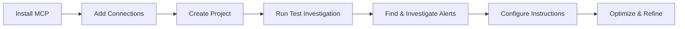

# Complete Onboarding Guide

Step-by-step guide to set up Hawkeye MCP and start investigating incidents.

## Overview

This guide walks you through the complete onboarding process for Hawkeye MCP:

### The Onboarding Journey



### Phases at a Glance

**📦 Prerequisites & Installation** _(5-10 minutes)_

- Install Hawkeye MCP Server and configure your AI client
- See [Installation Guide](../getting-started/installation.md) for details

**🔗 Phase 1: Add Connections** _(10-15 minutes)_

- Connect your cloud providers (AWS, Azure, GCP)
- Link monitoring tools (Datadog, PagerDuty, etc.)
- Wait for initial data sync

**📁 Phase 2: Create Project** _(5 minutes)_

- Set up your first project
- Link connections to the project
- Set as default project

**🔍 Phase 3: Run First Investigation** _(5-10 minutes)_

- Create a manual investigation to test the system
- Review the RCA (Root Cause Analysis)
- Understand the investigation output

**🎯 Phase 4: Find & Investigate Real Alerts** _(10-15 minutes)_

- List uninvestigated alerts from your systems
- Investigate a real incident
- Execute corrective actions

**📋 Phase 5: Configure Instructions** _(15-20 minutes)_

- Add SYSTEM instructions for context
- Create FILTER instructions to reduce noise
- Test RCA instructions on past incidents

**Total time:** 50-75 minutes

!!! tip "Phased Approach"
    You don't need to complete everything in one sitting! Many teams split this across multiple sessions:
    - **Day 1:** Install + Connections + Project (20-30 min)
    - **Day 2:** First investigations + Instructions (30-45 min)

## Prerequisites

Before starting, ensure you have:

- [x] **Hawkeye account** ([book demo](https://neubird.ai) if needed)
- [x] **Hawkeye MCP installed** (see [Installation Guide](../getting-started/installation.md))
- [x] **AI client configured** (Claude Desktop, Claude Code, Cursor, or GitHub Copilot)
- [x] **Cloud provider access** (AWS, Azure, or GCP credentials)
- [x] **Monitoring tool credentials** (Datadog, PagerDuty, New Relic, etc.)

!!! note "Installation Required"
    If you haven't installed Hawkeye MCP yet, follow the [Installation Guide](../getting-started/installation.md) first, then return here.

## Phase 1: Add Connections

Connect your cloud providers and monitoring tools to Hawkeye.

### Step 1.1: Understand Connections

Hawkeye needs access to your infrastructure to investigate incidents:

| Connection Type | What It Provides | Required? |
|----------------|------------------|-----------|
| **AWS** | CloudWatch logs/metrics, EC2, RDS, Lambda, etc. | ✅ Recommended |
| **Azure** | Azure Monitor, App Insights, VMs | ✅ If using Azure |
| **GCP** | Cloud Logging, Monitoring, Compute | ✅ If using GCP |
| **Grafana** | Prometheus, Loki, Tempo | ✅ If using Grafana with Kubernetes |
| **Datadog** | Logs, metrics, traces, APM | 🟡 Optional but helpful |
| **Dynatrace** | APM, infrastructure monitoring | 🟡 Optional |
| **PagerDuty** | Alert management, on-call schedules | 🟡 Optional |
| **ServiceNow** | Alert management, on-call schedules | 🟡 Optional |
| **FireHydrant** | Alert management, on-call schedules | 🟡 Optional |
| **Incident.io** | Alert management, on-call schedules | 🟡 Optional |


!!! tip "Start minimal"
    Begin with your primary cloud provider + one monitoring tool + one incident management tool. You can add more connections later.

### Step 1.2: Create AWS Connection

Ask Claude:

```
Create an AWS connection for my production environment
```

Claude will guide you through providing:
- **IAM Role ARN** and **ExternalId**
- **Regions** to monitor
- **Connection name** (e.g., "Production AWS")

**Example:**

```
✓ Created AWS connection: Production AWS
Role ARN: arn:aws:iam::1234567890:role/neubird-hawkeye-readonly
Status: Syncing (this may take 5-10 minutes)
ExternalID: <your-external-id>
Regions: us-east-1, us-west-2
```

Learn more about creating your AWS role here: [AWS Connection Setup](https://help.neubird.ai/getting_started/connection/cloud-providers/aws/)

### Step 1.3: Wait for Connection Sync

Check sync status:

```
Check the status of my AWS connection
```

Response:

```
Connection: Production AWS
Status: SYNCED ✓
Last sync: 2 minutes ago

Resources discovered:
- 45 EC2 instances
- 12 RDS databases
- 23 Lambda functions
- 156 CloudWatch alarms
```

!!! warning "First sync takes time"
    Initial sync can take 2-5 minutes depending on resource count. You can proceed to the next phase while it syncs. Be patient, it's worth it!

### Step 1.4: Add Monitoring Tools (Optional)

**Add Datadog:**

```
Add a Datadog connection with my API key and app key
```
Learn more about creating your Datadog API keys here: [Datadog Connection Setup](https://help.neubird.ai/getting_started/connection/monitoring/datadog/)

**Add PagerDuty:**

```
Connect my PagerDuty account for alert management
```
Learn more about creating your PagerDuty API keys here: [PagerDuty Connection Setup](https://help.neubird.ai/getting_started/connection/incident-management/pagerduty/)


### Step 1.5: Verify Connections

```
List all my Hawkeye connections
```

Expected output:

```
Found 2 connections:

1. Production AWS (AWS)
   Status: SYNCED and TRAINED ✅
   Telemetry Types: Alert, Config, Log, Metric

2. Production Datadog (Datadog)
   Status: SYNCED and TRAINED ✅
   Telemetry Types: Alert, Log, Metric

```

## Phase 2: Create Project

Projects organize your connections, instructions, and investigation history.

### Step 2.1: Understand Projects

A Hawkeye project organizes:
- **Connections** - Which cloud/monitoring tools to use
- **Instructions** - How to investigate incidents
- **Sessions** - Investigation history

Most teams start with one project per environment (Production, Staging, etc.).

### Step 2.2: Create Project

Ask Claude:

```
Create a new Hawkeye project called "Production"
```

Claude will use `hawkeye_create_project`:

```
✓ Created project "Production"
UUID: abc-123-def-456
Status: Active

Next steps:
1. Add connections
2. Configure instructions
3. Start investigating
```

**Save the Project UUID** - You'll need it for later steps.

### Step 2.3: Set as Default Project

Set this project as your default to avoid specifying project_uuid in every command:

```
Set Production as my default project
```

Or use the UUID directly:

```
hawkeye_set_default_project(project_uuid="abc-123-def-456")
```

Claude will confirm:

```
✓ Default project set to: Production
UUID: abc-123-def-456

All operations will now use this project by default.
```

**Benefits:**
- 🎯 No need to specify `project_uuid` in commands
- 🔄 Easy switching between environments later
- 💬 Use natural language: "Switch to Staging project"

!!! tip "Multiple Projects"
    If you create multiple projects (Production, Staging, Dev), you can quickly switch between them using `hawkeye_set_default_project`. The default persists for your entire MCP session.

### Step 2.4: Link Connections to Project

```
Add my AWS and Datadog connections to the Production project
```

Claude will use `hawkeye_add_connection_to_project`:

```
✓ Added 2 connections to Production project
- Production AWS (AWS)
- Production Datadog (Datadog)

Project is now ready for investigations!
```

### Step 2.5: Verify Project Setup

```
Show me details for my Production project
```

This uses `hawkeye_get_project_details`:

```
Production Project Details
━━━━━━━━━━━━━━━━━━━━━━━━━━━━━━━━━━━━━━━━━━━

UUID: abc-123-def-456
Status: Active
Created: Just now

Connections (2):
- Production AWS (AWS) - SYNCED
- Production Datadog (Datadog) - SYNCED

Instructions: None yet
Sessions: None yet
```

## Phase 3: Run First Investigation

Test the system with a manual investigation before waiting for real alerts.

### Step 3.1: Create a Test Investigation

Create a manual investigation to verify everything works:

```
Investigate potential memory leak in user-api pods that I noticed this morning.
Memory usage increased from 500MB to 1.2GB between 8am-10am UTC today.
No alerts fired yet but trending upward.
```

Claude will use `hawkeye_create_manual_investigation`:

```
✓ Created manual investigation
Session UUID: xyz-789-abc-123
Status: Running

Investigation will complete in 2-5 minutes.
Analyzing:
- CloudWatch metrics for memory usage
- Pod restart patterns
- Application logs
- Resource allocation changes
```

### Step 3.2: Wait for Completion

You can check status:

```
What's the status of my investigation?
```

Or wait 2-5 minutes and then get the RCA.

### Step 3.3: Review the RCA

```
Show me the root cause analysis
```

Claude uses `hawkeye_get_rca`:

```
Root Cause Analysis
━━━━━━━━━━━━━━━━━━━━━━━━━━━━━━━━━━━━━━━━━━━

Incident: Memory Leak - user-api
Severity: P2 (High)
Duration: Ongoing (2 hours)
Status: Active

ROOT CAUSE:
━━━━━━━━━━━━━━━━━━━━━━━━━━━━━━━━━━━━━━━━━━━
Memory leak caused by unclosed database connections
in the user session handler. Connection pool reached
maximum capacity, preventing cleanup of old connections.

TIMELINE:
━━━━━━━━━━━━━━━━━━━━━━━━━━━━━━━━━━━━━━━━━━━
08:00 UTC - Normal memory usage (500MB)
08:15 UTC - Gradual increase begins
09:00 UTC - Memory at 800MB (60% increase)
09:30 UTC - Connection pool at 85% capacity
10:00 UTC - Memory at 1.2GB (140% increase)
10:15 UTC - Connection pool at max (100 connections)

CORRECTIVE ACTIONS:
━━━━━━━━━━━━━━━━━━━━━━━━━━━━━━━━━━━━━━━━━━━
Immediate:
1. Restart affected pods to clear connections

   kubectl rollout restart deployment/user-api

2. Temporarily increase connection pool timeout

   kubectl set env deployment/user-api DB_POOL_TIMEOUT=30000

Long-term fixes:
1. Fix connection leak in code (user-session.js:45)
2. Implement connection pool monitoring
3. Add automated cleanup for stale connections

TIME SAVED:
━━━━━━━━━━━━━━━━━━━━━━━━━━━━━━━━━━━━━━━━━━━
Manual investigation time: ~30 minutes
Hawkeye investigation time: 2 minutes
Time saved: 28 minutes ⚡
```

### Step 3.4: Understanding the Output

Every RCA includes:

1. **Incident Summary** - What happened and severity
2. **Root Cause** - Why it happened with technical details
3. **Timeline** - Chronological event sequence
4. **Corrective Actions** - Ready-to-execute fixes
5. **Time Savings** - Efficiency metrics

!!! success "Test Complete!"
    If you got a detailed RCA like above, your setup is working correctly! The system successfully:
    - Connected to your cloud provider
    - Analyzed metrics and logs
    - Generated actionable insights

## Phase 4: Find & Investigate Real Alerts

Now that the system is working, investigate real incidents from your infrastructure.

### Step 4.1: List Uninvestigated Alerts

```
Show me uninvestigated incidents from the last 24 hours
```

This uses `hawkeye_list_sessions` with `only_uninvestigated=true`:

```
Found 3 uninvestigated incidents:

1. High API Latency - user-service
   Alert ID: /aws/cloudwatch/alerts/latency-spike-123
   Severity: P1
   Time: 2 hours ago
   Source: CloudWatch

2. Database Connection Pool Exhausted
   Alert ID: /datadog/alerts/db-pool-456
   Severity: P2
   Time: 4 hours ago
   Source: Datadog

3. Lambda Cold Start Timeout
   Alert ID: /aws/cloudwatch/alerts/lambda-789
   Severity: P3
   Time: 6 hours ago
   Source: CloudWatch
```

### Step 4.2: Investigate an Alert

```
Investigate the high API latency incident
```

Claude will:
1. Extract the `alert_id`
2. Call `hawkeye_investigate_alert`
3. Wait for completion (30-90 seconds)
4. Retrieve RCA automatically

```
🔍 Starting investigation...
⏳ Analyzing CloudWatch logs... (20s)
⏳ Checking application traces... (15s)
⏳ Reviewing database metrics... (10s)
⏳ Correlating events... (15s)

✓ Investigation complete! (60s total)
```

### Step 4.3: Review and Act

The RCA will provide:
- Root cause explanation
- Timeline of events
- Corrective actions (with bash commands)
- Preventive measures

Execute the recommended actions:

```bash
# Example corrective action from RCA
kubectl scale deployment/user-service --replicas=5
```

### Step 4.4: Ask Follow-Up Questions

```
Why wasn't this caught in staging?
Has this happened before?
What can we do to prevent it?
```

Claude uses `hawkeye_continue_investigation` to provide deeper insights.

## Phase 5: Configure Instructions

Fine-tune how Hawkeye investigates incidents by adding instructions.

### Step 5.1: Understand Instruction Types

| Type | Purpose | When to Use | Example |
|------|---------|-------------|---------|
| **SYSTEM** | Provide context about your architecture | Always (start with 1-2) | "We use microservices on Kubernetes" |
| **FILTER** | Reduce noise by filtering low-priority alerts | When getting too many alerts | "Only investigate P1 and P2 incidents" |
| **RCA** | Guide investigation steps for specific scenarios | For common incident types | "For database issues, check slow queries first" |
| **GROUPING** | Group related alerts together | When seeing duplicate alerts | "Group alerts from same service within 5 min" |

### Step 5.2: Add SYSTEM Instruction

Provide high-level context:

```
Create a SYSTEM instruction for my Production project:

"Our infrastructure runs on AWS EKS with 15 microservices.
We use PostgreSQL for databases and Redis for caching.
Peak traffic is 9am-5pm EST. We have auto-scaling enabled
for all services with min 2, max 10 replicas."
```

Claude uses `hawkeye_create_project_instruction`:

```
✓ Created SYSTEM instruction
Type: SYSTEM
Status: Active

This context will be used in all future investigations
to provide more relevant analysis.
```

### Step 5.3: Add FILTER Instruction

Reduce noise:

```
Create a FILTER instruction for my Production project:

"Only investigate incidents with severity P1 (Critical)
or P2 (High). Ignore P3 and P4 alerts unless they occur
more than 5 times in 10 minutes."
```

This prevents low-priority alerts from creating unnecessary investigations.

### Step 5.4: Add RCA Instruction

Guide investigation for common scenarios:

```
Create an RCA instruction for my Production project:

"For database-related incidents:
1. Check for slow queries (>1 second)
2. Review connection pool usage
3. Analyze index usage with EXPLAIN
4. Check for table locks or deadlocks
5. Suggest specific index improvements"
```

### Step 5.5: Test Instructions on Past Incidents

Before deploying instructions broadly, test them:

```
I want to test this new RCA instruction on the database
incident from yesterday. Apply it to that session and rerun
the investigation.
```

Claude will:
1. Apply instruction to specific session
2. Rerun the investigation
3. Compare new RCA vs original
4. Help you decide if it improved the results

See [Testing Instructions Guide](using-instructions.md) for detailed workflow.

### Step 5.6: Verify Instructions

```
List all instructions for my Production project
```

```
Found 3 instructions:

1. Architecture Context (SYSTEM)
   Status: Active
   Created: 10 minutes ago

2. Priority Filter (FILTER)
   Status: Active
   Created: 5 minutes ago

3. Database Investigation Steps (RCA)
   Status: Active
   Created: 2 minutes ago
```

## Optimize & Refine

Continuous improvement tips for getting the most from Hawkeye.

### Monitor Investigation Quality

```
Show me analytics for the last 7 days
```

Review metrics:
- **MTTR** (Mean Time To Resolution)
- **Time Saved** vs manual investigation
- **Investigation Quality Scores**
- **Noise Reduction** from filtering

### Refine Instructions

Based on investigation results:

1. **Too many investigations?** → Add/adjust FILTER instructions
2. **Missing context?** → Update SYSTEM instructions
3. **Incomplete RCA?** → Add specific RCA instructions
4. **Duplicate alerts?** → Configure GROUPING instructions

### Add More Connections

As your needs grow:

```
Add Azure connection for our secondary region
Add New Relic for application monitoring
```

### Create Environment-Specific Projects

```
Create "Staging" project
Create "Development" project
```

Each project can have different:
- Connections (staging vs prod resources)
- Instructions (different investigation depth)
- Alert thresholds

## Next Steps

<div class="grid cards" markdown>

-   :material-alert-circle: __Daily Workflows__

    ---

    Common investigation patterns for day-to-day use

    [:octicons-arrow-right-24: Daily Workflows](../examples/daily-workflows.md)

-   :material-test-tube: __Testing Instructions__

    ---

    Learn to validate and test instructions safely

    [:octicons-arrow-right-24: Testing Instructions](using-instructions.md)

-   :material-tools: __Advanced Workflows__

    ---

    Power user techniques and optimization

    [:octicons-arrow-right-24: Advanced Workflows](advanced-workflows.md)

</div>

## Summary Checklist

By the end of this guide, you should have:

- [x] Installed and configured Hawkeye MCP
- [x] Added cloud connections (AWS, Datadog, etc.)
- [x] Created your first project
- [x] Set it as your default project
- [x] Run a test investigation
- [x] Investigated real alerts
- [x] Configured investigation instructions
- [x] Reviewed RCA and executed corrective actions
- [x] Tested and refined instructions

**Congratulations!** You're now ready to use Hawkeye MCP for autonomous incident investigation.

## Getting Help

- **Inline Help:** Ask Claude "How do I..." and use the guidance system
- **Documentation:** Browse [other guides](running-investigations.md)
- **Examples:** See [real-world examples](../examples/complete-setup.md)
- **Support:** Contact [NeuBird](https://neubird.ai) for assistance
