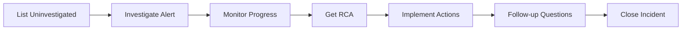

# Running Investigations

Master the art of AI-powered incident investigation with Hawkeye MCP. This guide covers both alert-based and manual investigations.

## Quick Reference



## Finding Alerts to Investigate

### List Uninvestigated Alerts

Ask Claude:

```
Show me uninvestigated alerts from the last 24 hours
```

Uses `hawkeye_list_sessions` with `only_uninvestigated=true`.

**Filtering options:**

```
Show me uninvestigated P1 alerts from the last 7 days
```

```
Find uninvestigated database alerts
```

```
Show me alerts from api-service in the last hour
```

### Understanding Alert Information

Each alert shows:

| Field | Description |
|-------|-------------|
| **Alert ID** | Unique identifier for investigation |
| **Title** | Incident description |
| **Severity** | P1 (critical) to P4 (low) |
| **Timestamp** | When alert fired |
| **Source** | Monitoring tool (CloudWatch, Datadog, etc.) |

**Important:** The `alert_id` (shown as `incident_info.id`) is what you use to start an investigation.

## Starting an Investigation

### Basic Investigation

```
Investigate alert ID: /subscriptions/.../alerts/cpu-spike-123
```

Or simply:

```
Investigate the first alert
```

Claude will:
1. Extract the `alert_id`
2. Call `hawkeye_investigate_alert`
3. Monitor progress using `hawkeye_get_investigation_status`
4. Retrieve RCA when complete

## Manual Investigations

Create investigations from custom prompts without needing an existing alert.

### When to Use Manual Investigations

- **Proactive analysis** - Investigate potential issues before they become alerts
- **Historical research** - Analyze past incidents not captured as alerts
- **What-if scenarios** - Test hypothetical situations
- **Training** - Create example investigations for documentation
- **Testing** - Validate system behavior without waiting for real alerts

### Creating a Manual Investigation

**Good prompt (specific):**

```
Investigate high latency in payment-service between 2pm-3pm EST on Jan 15, 2025.
Users reported checkout taking 30+ seconds instead of the usual 2 seconds.
```

**Bad prompt (too vague):**

```
Something went wrong with the payment service
```

Claude will use `hawkeye_create_manual_investigation`:

```
✓ Created manual investigation
Session UUID: abc-123-def-456
Status: Running

Investigation will complete in 2-5 minutes.
Use hawkeye_get_rca to retrieve results.
```

### Prompt Quality Guidelines

**✅ Include these details:**

1. **Service/Resource names** - Which components are involved?
2. **Time frame** - When did this occur or should be analyzed?
3. **Symptoms** - What behavior are you seeing?
4. **Context** - Any additional relevant information?

**❌ Avoid:**

- Vague descriptions ("something broke")
- No timeframe ("recently", "earlier")
- Missing service names ("the API", "the database")

**Example prompts:**

```
Investigate memory leak in user-api pods in production namespace.
Started around 8am UTC today, memory usage climbing from 500MB to 2GB.
```

```
Analyze database connection pool exhaustion in postgres-primary.
Between 1pm-2pm EST yesterday. Connection count hit max of 100.
```

```
Check for cascading failures in microservices during deployment.
January 10, 2025 at 3:15pm UTC. Multiple services returned 503 errors.
```

### Agent Behavior

If your prompt is too vague, Claude will ask clarifying questions:

```
You: Investigate the payment issue

Claude: I need more details to create an effective investigation:
- Which payment service? (payment-api, payment-processor, etc.)
- When did this occur? (specific date/time or time range)
- What symptoms did you observe? (errors, slow response, failures?)
- Any other context? (deployment, traffic spike, etc.)
```

### Workflow

**Complete manual investigation workflow:**

```
1. Create investigation
   Investigate API latency spike in checkout-service on Jan 15 between 2-3pm EST

2. Wait for completion (2-5 minutes)
   Check status with: What's the status of this investigation?

3. Get RCA
   Show me the root cause analysis

4. Ask follow-ups
   What caused the latency spike?
   Were there any related infrastructure changes?
```

### Parameters

The tool accepts:

| Parameter | Type | Default | Description |
|-----------|------|---------|-------------|
| `prompt` | string | required | Investigation description (min 10 chars) |
| `project_uuid` | string | optional | Uses default project if not specified |

!!! tip "Using Default Project"
    If you've set a default project with `hawkeye_set_default_project`, you don't need to specify `project_uuid`. Manual investigations will automatically use your default project.

### Comparison with Alert-Based Investigations

| Feature | Alert-Based | Manual |
|---------|-------------|--------|
| **Trigger** | Existing alert | Custom prompt |
| **Use Case** | React to alerts | Proactive analysis |
| **Alert ID** | Required | Not needed |
| **Prompt** | Auto-generated | You provide |
| **Flexibility** | Limited to alert data | Any scenario |

## Understanding the RCA

### RCA Structure

Every RCA includes:

**1. Incident Summary**

- What happened
- When it happened
- Current status

**2. Timeline**

- Chronological event sequence
- Key state changes
- System behaviors

**3. Root Cause**

- Why it happened
- Contributing factors
- Technical details

**4. Corrective Actions**

- Immediate fixes (often auto-executed)
- Manual actions needed
- Ready-to-execute bash scripts

**5. Time Savings**

- Manual investigation time estimate
- Actual Hawkeye time
- Time saved

## Asking Follow-Up Questions

### Common Follow-Ups

**Understanding the cause:**
```
Why did this happen?
Has this happened before?
What changed recently?
```

**Investigation details:**
```
What data sources were checked?
Show me the logs that were analyzed
What queries were run?
```

**Prevention:**
```
How can we prevent this?
What monitoring should we add?
What tests would catch this?
```

**Similar incidents:**
```
Have we seen similar issues?
Is this related to recent deployments?
Are other services affected?
```

### Follow-Up Workflow

```
# After getting RCA
Show me the chain of thought for this investigation
```

Uses `hawkeye_get_chain_of_thought` to show reasoning steps.

```
What data sources were consulted?
```

Uses `hawkeye_get_investigation_sources`.

```
What queries were executed?
```

Uses `hawkeye_get_investigation_queries`.

```
What are suggested follow-up questions?
```

Uses `hawkeye_get_follow_up_suggestions`.

## Implementing Corrective Actions

One of the most powerful features of Hawkeye MCP is that you can ask your AI coding agent to directly implement the recommended fixes. Your agent has full context of both your codebase and Hawkeye's analysis.

### The Power of MCP Integration

Because Hawkeye runs as an MCP server, your coding agent (Claude Code, Claude Desktop, Cursor, etc.) can:

1. **Get the RCA** with detailed corrective actions
2. **Understand your codebase** through file access
3. **Implement fixes** directly in your code
4. **Execute commands** through its shell access
5. **Verify the fix** by checking logs and metrics

This creates a seamless incident response workflow where investigation and remediation happen in the same conversation.

### Workflow: From Investigation to Implementation

**Step 1: Get the RCA**
```
Show me the RCA for this investigation
```

**Step 2: Ask your agent to implement the fix**
```
Please implement the corrective actions from this RCA.
Start with the highest priority items.
```

**Step 3: Your agent will:**
- Read the relevant code files
- Make the necessary changes
- Run tests to verify
- Execute deployment commands (if appropriate)
- Confirm the changes

### Example: Implementing a Database Index

**Investigation finds:** Missing index causing slow queries

**RCA provides:**
```bash
CREATE INDEX CONCURRENTLY idx_orders_user_id ON orders(user_id);
```

**You ask your agent:**
```
Please add this database index. Use a migration file
following our project's migration pattern.
```

**Your agent will:**
1. Check existing migration files to understand the pattern
2. Create a new migration file (e.g., `20250124_add_orders_user_id_index.sql`)
3. Add the CREATE INDEX statement with proper syntax
4. Add a corresponding DROP INDEX for rollback
5. Update the migration tracking
6. Suggest running the migration command

### Example: Fixing a Configuration Issue

**Investigation finds:** Connection pool too small for traffic

**RCA provides:**
```bash
kubectl set env deployment/api-service MAX_CONNECTIONS=200
```

**You ask your agent:**
```
Please update the MAX_CONNECTIONS configuration to 200.
Update both the deployment manifest and our docs.
```

**Your agent will:**
1. Find the deployment YAML file
2. Update the environment variable
3. Update documentation to reflect the change
4. Suggest applying with `kubectl apply -f deployment.yaml`
5. Offer to add monitoring for connection pool usage

### Example: Implementing a Code Fix

**Investigation finds:** Memory leak from unclosed database connections

**RCA explains:** Connections not being released in error paths

**You ask your agent:**
```
Please fix the connection leak in the payment service.
Make sure all code paths properly close connections.
```

**Your agent will:**
1. Read the payment service code
2. Identify all database connection usage
3. Add proper try/finally blocks or context managers
4. Ensure connections are closed in error paths
5. Add tests to verify the fix
6. Run existing tests to ensure no regressions

### Preventive Measures

After fixing the immediate issue, implement preventive measures:

```
Please implement the preventive measures from the RCA:
1. Add monitoring for connection pool usage
2. Add alerts for connection pool >80% full
3. Update our runbook with this scenario
```

### Best Practices for Agent-Driven Remediation

**✅ Do:**
- Review the RCA thoroughly before asking for implementation
- Be specific about your project's patterns and conventions
- Ask the agent to run tests after making changes
- Request documentation updates alongside code changes
- Have the agent explain what it's doing
- Use staging environments for testing changes

**❌ Don't:**
- Blindly apply changes to production without review
- Skip testing steps
- Implement changes you don't understand
- Ignore the agent's warnings or questions
- Rush through validation steps

### Manual Review Required

Some actions require human judgment and shouldn't be fully automated:

**Deployment decisions:**
- Rolling back to previous versions
- Scaling production resources
- Database schema changes
- Infrastructure modifications

**For these, ask your agent to:**
```
Please prepare the rollback command but don't execute it yet.
Show me what will happen and wait for my approval.
```

### Bash Scripts in RCA

RCAs include ready-to-run commands for immediate fixes:

```bash
# Example: Add database index
psql -h prod-db.rds.amazonaws.com -U admin -d production

CREATE INDEX CONCURRENTLY idx_orders_user_id
  ON orders(user_id);
```

You can execute these directly or ask your agent to integrate them into your workflow:

```
Please add this as a migration following our standard process.
```

### Validation Checklist

Before executing any fix, verify:

- [x] Commands are safe (no destructive operations)
- [x] Correct environment (prod vs staging)
- [x] Proper permissions and access
- [x] Backup/rollback plan in place
- [x] Tests pass after changes
- [x] Changes follow project conventions
- [x] Documentation is updated

## Advanced Investigation Techniques

### Filtering by Severity

```
Show me only P1 and P2 uninvestigated alerts
```

### Filtering by Date Range

```
Show me uninvestigated alerts from January 1-15
```

### Searching by Keyword

```
Find alerts related to "database timeout"
```

Uses `search_term` parameter in `hawkeye_list_sessions`.

### Compact Mode

For large result sets:

```
Show me all uninvestigated alerts in compact format
```

Returns minimal details for faster browsing.

### Investigation Status Tracking

Check ongoing investigations:

```
Show me the status of session abc-123-def-456
```

Uses `hawkeye_get_investigation_status`.

## Real-Time Progress Monitoring

Hawkeye provides live streaming updates during investigations, giving you visibility into what's happening at each step.

### Understanding Progress Updates

When an investigation is running, `hawkeye_get_investigation_status` provides:

**Current Progress:**
- **progress_percentage**: 0-100 indicating completion based on completed steps
- **current_step**: Human-readable description of what's happening now
- **status**: Investigation state (in_progress, completed, failed)

**Investigation Breakdown:**
- **total_steps**: Estimated number of investigation steps
- **completed_steps**: How many steps have finished
- **unique_sources**: All data sources consulted (logs, metrics, alarms)

**Step Details:**
Each step includes:
- **step_id**: Unique identifier for detailed lookups
- **step_number**: Sequential step number
- **description**: What question is being answered
- **category**: Type of investigation step (see below)
- **status**: Step state (in_progress, completed, possible_question)
- **sources_consulted**: Which data sources contributed to this step

### Investigation Step Categories

Each step is categorized by its purpose:

| Category | Purpose | Example |
|----------|---------|---------|
| **discovery** | Initial fact-finding and data gathering | "What was the system.load.1 metric value?" |
| **analysis** | Examining patterns and correlations | "Analyzing correlation between CPU and memory" |
| **diagnosis** | Root cause identification | "Identifying why the process failed" |
| **remediation** | Solution recommendations | "Suggesting corrective actions" |
| **validation** | Verification of findings | "Confirming the root cause hypothesis" |

### Monitoring Recommendations

**Polling frequency:**
- Check status every 10-15 seconds for updates
- More frequent polling won't speed up investigation
- Less frequent means you might miss interim progress

**What to watch:**

```
Show me the investigation status

# Look for:
# - progress_percentage: How far along (0-100)
# - current_step: What's happening right now
# - unique_sources: Which data sources have been checked
# - completed_steps / total_steps: Step progress
```

### Data Source Attribution

The `unique_sources` field shows exactly which monitoring systems contributed to the investigation:

**Example sources:**
```
unique_sources: [
  "log_datadog.datadog_logs",
  "monitor_datadog.monitor_events",
  "alarm_aws_poc_sandbox.alarm_history",
  "log_aws_poc_sandbox.log_aws_containerinsights_eks_htm_prod",
  "metric_aws_poc_sandbox.cloudwatch_metrics"
]
```

**Why this matters:**
- **Verify comprehensive coverage** - Ensure all relevant systems were checked
- **Understand thoroughness** - More sources = more thorough analysis
- **Identify gaps** - Missing expected sources? May indicate sync issues
- **Debug investigations** - See exactly what data was available

### Progress Example

**Starting an investigation:**
```json
{
  "session_uuid": "abc123...",
  "status": "in_progress",
  "progress_percentage": 0,
  "current_step": "Initializing investigation...",
  "investigation_summary": {
    "total_steps": 5,
    "completed_steps": 0,
    "total_sources_consulted": 0,
    "unique_sources": []
  }
}
```

**Mid-investigation:**
```json
{
  "session_uuid": "abc123...",
  "status": "in_progress",
  "progress_percentage": 45,
  "current_step": "🔍 Discovery: Analyzing system.load.1 metrics across production hosts",
  "investigation_summary": {
    "total_steps": 5,
    "completed_steps": 2,
    "total_sources_consulted": 8,
    "unique_sources": [
      "log_datadog.datadog_logs",
      "monitor_datadog.monitor_events",
      "alarm_aws_poc_sandbox.alarm_history"
    ],
    "steps": [
      {
        "step_id": "69247c6b517e7056d602abd1",
        "step_number": 1,
        "description": "What was the system.load.1 metric value and which hosts experienced load average above 2.0?",
        "category": "discovery",
        "status": "completed",
        "sources_consulted": [
          "monitor_datadog.monitor_events",
          "log_datadog.datadog_logs"
        ]
      },
      {
        "step_id": "69247c6b517e7056d602abd2",
        "step_number": 2,
        "description": "Analyzing CPU and memory usage patterns during the incident",
        "category": "analysis",
        "status": "in_progress",
        "sources_consulted": [
          "alarm_aws_poc_sandbox.alarm_history"
        ]
      }
    ]
  }
}
```

### Typical Investigation Flow

**Phase 1: Discovery (0-30%)**
- Gathering initial facts
- Identifying affected resources
- Collecting metrics and logs
- Timeline construction

**Phase 2: Analysis (30-60%)**
- Pattern detection
- Correlation analysis
- Comparing with baselines
- Examining related events

**Phase 3: Diagnosis (60-85%)**
- Root cause identification
- Validating hypotheses
- Determining contributing factors
- Impact assessment

**Phase 4: Remediation (85-100%)**
- Generating corrective actions
- Creating preventive measures
- Calculating time savings
- Finalizing RCA report

### Common Progress Patterns

**Fast start, then slower:**
```
0% → 40% (first minute) → 60% (next 2 minutes) → 100%
```
Initial discovery is quick, detailed analysis takes longer.

**Steady progress:**
```
0% → 20% → 40% → 60% → 80% → 100% (evenly paced)
```
Indicates straightforward incident with clear data.

**Stuck at percentage:**
```
0% → 45% (stays here for 1-2 minutes) → 100%
```
Normal for complex data queries or correlation analysis.

## Investigation Quality

### Quality Scoring

Every investigation gets scored on:

- **Accuracy** (Root cause correctness, impact analysis)
- **Completeness** (Data coverage, remediation steps)

Check quality:

```
Show me the quality score for this investigation
```

Uses `hawkeye_get_rca_score`.

**Good scores:** 85-100 (Excellent)
**Acceptable:** 70-84 (Good)
**Needs improvement:** <70 (Add more instructions)

### Improving Quality

**Add context instructions:**
```
Create a SYSTEM instruction about our architecture
```

**Add investigation steps:**
```
Create an RCA instruction for database issues
```

**Provide feedback:**
If an RCA is incorrect, add an instruction to guide future investigations.

## Common Investigation Patterns

### Pattern 1: API Latency

**Symptoms:** Slow API responses, timeouts

**Investigation approach:**
1. Check APM traces (Datadog, New Relic)
2. Review database query performance
3. Check external API dependencies
4. Examine cache hit rates
5. Review resource utilization

**Common causes:**
- Missing database indexes
- Inefficient queries
- External API slowdowns
- Cache misses
- Insufficient resources

### Pattern 2: Memory Leaks

**Symptoms:** Increasing memory, eventual OOM crash

**Investigation approach:**
1. Review memory growth timeline
2. Check for unclosed connections
3. Look for accumulating caches
4. Examine heap dumps
5. Review recent code changes

**Common causes:**
- Unclosed database connections
- Event listener leaks
- Growing in-memory caches
- Circular references

### Pattern 3: Database Issues

**Symptoms:** Slow queries, connection timeouts

**Investigation approach:**
1. Check slow query logs
2. Review connection pool metrics
3. Examine table locks
4. Check index usage
5. Review database resource metrics

**Common causes:**
- Missing indexes
- Lock contention
- Connection pool exhaustion
- Long-running transactions
- Inefficient queries

### Pattern 4: Deployment Failures

**Symptoms:** Service crashes after deployment

**Investigation approach:**
1. Compare deployment manifests
2. Review container startup logs
3. Check environment variables
4. Examine health check failures
5. Review resource limits

**Common causes:**
- Configuration errors
- Missing environment variables
- Insufficient resources
- Database migration failures
- Incompatible dependencies

## Workflow Tips

### Morning Review

```
# Check overnight incidents
Show me uninvestigated alerts from the last 12 hours

# Investigate critical ones
Investigate all P1 alerts
```

### Incident Response

```
# During active incident
Show me alerts from the last 30 minutes

# Quick investigation
Investigate this alert and wait for results

# Get actionable fixes
Show me the corrective actions
```

### Post-Mortem

```
# Review incident
Show me the complete RCA for session abc-123

# Understand what happened
Show me the timeline and chain of thought

# Prevent recurrence
What preventive measures are recommended?
```

## Troubleshooting Investigations

### Investigation Taking Too Long

**Normal duration:** 30-90 seconds

**If longer:**
- First investigation may take 5-10 minutes (syncing connections)
- Complex incidents with many data sources take longer
- Check connection sync status

### Incomplete RCA

**If RCA lacks details:**
1. Add more SYSTEM instructions with context
2. Add RCA instructions with investigation steps
3. Ensure connections are properly synced
4. Check data source availability

### Incorrect Root Cause

**If RCA misidentifies the cause:**
1. Use follow-up questions to guide investigation
2. Add instruction with correct approach
3. Test instruction on past session
4. Add to project if improved

## Next Steps

<div class="grid cards" markdown>

-   :material-file-document-edit: __Use Instructions__

    ---

    Learn to create and test investigation instructions

    [:octicons-arrow-right-24: Using Instructions](using-instructions.md)

-   :material-connection: __Manage Connections__

    ---

    Add and configure data sources

    [:octicons-arrow-right-24: Managing Connections](managing-connections.md)

-   :material-tools: __Advanced Workflows__

    ---

    Power user techniques

    [:octicons-arrow-right-24: Advanced Workflows](advanced-workflows.md)

</div>
