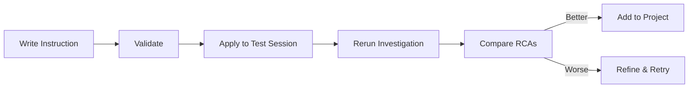

# Using Instructions

Learn to create, test, and manage investigation instructions to guide Hawkeye's behavior.

## What Are Instructions?

Instructions are guidelines you provide to Hawkeye that customize how it investigates incidents. They help Hawkeye understand your infrastructure, follow your investigation patterns, filter out noise, and focus on what matters for your organization.

Think of instructions as teaching Hawkeye about your specific environment and how you want it to work.

## Instruction Types

Hawkeye supports four types of instructions, each serving a specific purpose:

### FILTER Instructions

**Purpose:** Reduce noise by filtering out low-value alerts

**When to use:**

- You're getting too many minor alerts
- Certain alert sources are unreliable
- You want to focus on critical incidents only

**Example:**
```
Only investigate incidents with:
- Severity P1 or P2
- Affecting production environment
- Not from load testing systems
- Not during scheduled maintenance windows
```

**Impact:** Alerts matching these criteria won't be investigated, reducing noise and focusing attention on important issues.

### SYSTEM Instructions

**Purpose:** Provide architectural context and infrastructure details

**When to use:**

- Hawkeye needs to understand your architecture
- Investigations lack context about your systems
- You want better root cause analysis
- You need service-specific guidance

**Example:**
```
Our infrastructure:
- Microservices architecture on AWS EKS
  - api-service: Handles REST API requests
  - payment-service: Processes payments via Stripe
  - user-service: Authentication and user management
  - notification-service: Email and SMS notifications
  - worker-service: Background job processing

- Databases:
  - PostgreSQL RDS (primary + 2 read replicas)
  - Redis ElastiCache for session storage and caching

- Monitoring:
  - Datadog APM for distributed tracing
  - CloudWatch for AWS metrics
  - PagerDuty for alerting

- Traffic patterns:
  - Peak: 1000 req/sec between 2-6pm EST
  - Normal: 200 req/sec outside peak hours
  - Scheduled deployments: Tuesdays 10am EST
```

**Impact:** Hawkeye uses this context to make better inferences about root causes and dependencies.

### GROUPING Instructions

**Purpose:** Group related alerts together to avoid duplicate investigations

**When to use:**

- Multiple alerts fire for the same underlying issue
- Cascading failures create alert storms
- You want to investigate grouped incidents once

**Example:**
```
Group incidents when:
- Same service and error type within 15 minutes
- Same root cause indicator (deployment, database outage)
- Cascading failures from single upstream service
- Auto-scaling events triggering multiple alerts
```

**Impact:** Related alerts are grouped into a single investigation, reducing duplicate work.

### RCA Instructions

**Purpose:** RCA instructions define what sections to include in RCA reports, language preferences, and how findings should be presented. They standardize report structure across all investigations.

**When to use:**

- You need standardized RCA report formatting for your organization
- Reports must be readable for both technical and non-technical stakeholders
- You want consistent documentation structure across all incidents
- Compliance or organizational standards require specific report sections
- You need RCAs formatted for specific audiences (leadership, regulators, etc.)

**Example - Standardized RCA Report Format:**

**Prompt:**
```
Create an RCA instruction for my Test Production project:

"All RCA reports must include these sections:
1. Executive Summary - A 2-3 sentence overview suitable for leadership
2. Impact Assessment - Include affected services, user impact percentage, and estimated revenue impact if applicable
3. Timeline - Use UTC timestamps and include detection time, first response, and resolution time
4. Root Cause - Explain in both technical and non-technical terms
5. Corrective Actions - Separate into 'Immediate' (within 24h) and 'Long-term' (within 30 days)
6. Prevention Measures - Include specific monitoring thresholds to add

Format the report in markdown with clear headers. Keep technical jargon to a minimum in the Executive Summary section."
```

**What this instruction does:**
- Ensures consistent report structure across all investigations
- Makes RCAs readable for both technical and non-technical stakeholders
- Provides clear action items with timelines
- Includes forward-looking prevention measures

**Impact:** All RCA reports follow your organization's documentation standards and include the sections required by your stakeholders.

## Why Test Instructions?

**Problem:** Bad instructions affect ALL future investigations.

**Solution:** Test instructions on past investigations before adding to your project.

Testing ensures your instruction:
- Actually improves the investigation quality
- Doesn't introduce false positives or noise
- Works with your actual data and alert patterns
- Produces actionable recommendations



## Quick Start: Testing Workflow

### 5-Step Testing Process

```
1. Pick a past investigation as test case
2. Validate your instruction
3. Apply instruction to that session
4. Rerun the investigation
5. Compare new RCA with original
```

**Only add to project if the new RCA is better!**

## Step-by-Step Testing Guide

### Step 1: Choose a Test Session

Find a past investigation to test against:

```
Show me investigations from the last 7 days
```

Pick one that represents the type of incident your instruction targets.

**Example:**
```
I want to test an instruction for database issues.
Show me database-related investigations.
```

Save the `session_uuid` from the results.

### Step 2: Write Your Instruction

Draft the instruction content:

**Example - API Latency Investigation:**
```
For API latency or timeout incidents:

1. Check database query performance in slow query logs
2. Review connection pool metrics (active, idle, waiting)
3. Examine API endpoint traces in Datadog APM
4. Check for downstream service latency
5. Verify cache hit rates in Redis
6. Look for recent deployments or configuration changes
7. Analyze request rate patterns and traffic spikes
8. Provide specific optimization recommendations with commands
```

### Step 3: Validate the Instruction

```
Validate this RCA instruction:

"For API latency or timeout incidents:
1. Check database query performance in slow query logs
2. Review connection pool metrics (active, idle, waiting)
3. Examine API endpoint traces in Datadog APM
4. Check for downstream service latency
5. Verify cache hit rates in Redis
6. Look for recent deployments or configuration changes
7. Analyze request rate patterns and traffic spikes
8. Provide specific optimization recommendations with commands"
```

Uses `hawkeye_validate_instruction`:

```
✓ Instruction validated successfully

Generated name: "API Latency Investigation Methodology"
Type: RCA
Refined content: [AI-improved version]

The instruction is ready to test.
```

### Step 4: Apply to Test Session

```
Apply this instruction to session abc-123-def-456
```

Uses `hawkeye_apply_session_instruction`:

```
✓ Instruction applied to test session

The instruction has been added as a session-specific
override. It will ONLY affect this session when rerun.

Next step: Rerun the investigation to see the impact.
```

### Step 5: Rerun the Investigation

```
Rerun session abc-123-def-456 with the new instruction
```

Uses `hawkeye_rerun_session`:

```
🔍 Rerunning investigation...
⏳ Applying new instruction... (5s)
⏳ Re-analyzing data... (30s)
⏳ Generating new RCA... (15s)

✓ Investigation complete! (50s total)
```

### Step 6: Compare Results

```
Show me the RCA for session abc-123-def-456
```

Uses `hawkeye_get_rca`:

```
Root Cause Analysis (UPDATED)
━━━━━━━━━━━━━━━━━━━━━━━━━━━━━━━━━━━━━━━━━━━

[NEW] Database Query Analysis:
Identified slow query in checkout endpoint:
Query: SELECT * FROM orders WHERE user_id = ?
Execution time: 850ms (vs 5ms baseline)

[NEW] Missing Index Identified:
CREATE INDEX CONCURRENTLY idx_orders_user_id
  ON orders(user_id);

Estimated improvement: 850ms → 5ms (99.4% faster)

[NEW] Connection Pool Analysis:
- Current utilization: 95/100 connections
- Peak during incident: 100/100 (exhausted)
- Recommendation: Increase pool size to 150

[NEW] Cache Performance:
- Cache hit rate: 45% (baseline: 85%)
- Cache invalidation spike detected at incident start
- Related to recent deployment at 2:15pm

[NEW] Deployment Correlation:
Deployment of checkout-service v2.3.1 at 2:15pm
introduced N+1 query pattern in order lookup.

The new RCA includes specific actionable insights
that were missing in the original investigation!
```

### Step 7: Decision Time

**Compare with original RCA:**

| Aspect | Original RCA | New RCA |
|--------|-------------|---------|
| Root cause identified | ✓ Generic | ✓ Specific |
| Specific queries shown | ✗ No | ✓ Yes |
| Index suggestion | ✗ Generic | ✓ Specific SQL |
| Performance estimate | ✗ No | ✓ Yes |
| Connection pool analysis | ✗ No | ✓ Yes |
| Cache analysis | ✗ No | ✓ Yes |
| Deployment correlation | ✗ No | ✓ Yes |

**Verdict:** New RCA is significantly better!

### Step 8: Add to Project

```
This instruction improved the RCA. Add it to my Production project.
```

Uses `hawkeye_create_project_instruction`:

```
✓ Created RCA instruction for Production project
Name: "API Latency Investigation Methodology"
Status: Active

All future API latency investigations will use this
instruction to provide detailed performance analysis.
```

## Best Practices

### Writing Effective Instructions

**✅ Do:**
- Be specific and actionable
- Reference actual tools and systems you use
- Include commands or queries when relevant
- Focus on outcomes (what to find, not how)
- Use clear, numbered steps for RCA instructions
- Include context about your environment
- Test before deploying

**❌ Don't:**
- Write vague instructions ("check performance")
- Reference tools you don't have ("check EXPLAIN output" if not logged)
- Create instructions for edge cases
- Make instructions too long (keep under 300 words)
- Add instructions without testing
- Duplicate information across instructions

### Testing Strategies

**Test multiple scenarios:**
```
1. Test on the incident type you're targeting
2. Test on a related but different incident type
3. Test on an unrelated incident type
```

This ensures your instruction helps the right cases and doesn't hurt others.

**Iterate based on results:**
- First version too broad? Make it more specific
- Missing important checks? Add more steps
- Too prescriptive? Make it more flexible
- Not improving results? Refine or discard

### Managing Instructions

**Review regularly:**
```
Show me all active instructions for Production project
```

**Disable underperforming instructions:**
```
Disable the instruction "Database Performance Checks"
```

**Update instructions as your system evolves:**
- New services added? Update SYSTEM instructions
- New monitoring tools? Update RCA instructions
- Alert patterns changed? Update FILTER instructions

## Common Instruction Patterns

### Pattern 1: Service-Specific Investigation

```
For incidents affecting the payment-service:

1. Check Stripe API response times and error rates
2. Review payment transaction logs for failures
3. Examine database connection pool for payment DB
4. Check for PCI compliance logging issues
5. Verify webhook delivery status
6. Look for rate limiting from Stripe
```

### Pattern 2: Time-Based Context

```
SYSTEM instruction:

Scheduled maintenance:
- Database backups: Daily 2-3am EST
- Deployment windows: Tuesday/Thursday 10am EST
- Cache warmup: After each deployment (5-10 min)
- Traffic patterns: Peak 2-6pm EST weekdays

Consider timing when analyzing incident causes.
```

### Pattern 3: Cascading Failure Detection

```
GROUPING instruction:

Group incidents when they occur within 15 minutes and:
- Multiple services report connection timeouts
- Database or Redis metrics show anomalies
- Gateway/load balancer shows elevated errors
- Upstream service degradation detected

Likely cascading failure from shared dependency.
```

### Pattern 4: Noise Reduction

```
FILTER instruction:

Do NOT investigate:
- Alerts from dev/staging environments
- Load test results from automated testing
- Synthetic monitoring checks (exclude alert tag: synthetic)
- Auto-scaling events (normal operational behavior)
- Alerts during maintenance windows (2-3am EST)
```

## Troubleshooting Instructions

### Instruction Not Improving RCA

**Possible causes:**
1. Instruction too vague
2. Data sources don't support the checks
3. Instruction targets wrong incident type
4. System context missing

**Solution:** Refine and test again with more specific guidance.

### Instruction Causing Worse Results

**Possible causes:**
1. Too prescriptive (limiting Hawkeye's analysis)
2. Incorrect assumptions about infrastructure
3. Conflicts with other instructions

**Solution:** Disable, refine, or remove the instruction.

### Instruction Not Being Applied

**Check:**
1. Instruction is active (not disabled)
2. Instruction type matches use case
3. No conflicting instructions
4. Project has the instruction

```
Show me instruction details for [instruction-uuid]
```

## Next Steps

<div class="grid cards" markdown>

-   :material-alert: __Run Investigations__

    ---

    Apply your instructions to real incidents

    [:octicons-arrow-right-24: Running Investigations](running-investigations.md)

-   :material-connection: __Manage Connections__

    ---

    Connect data sources for investigations

    [:octicons-arrow-right-24: Managing Connections](managing-connections.md)

-   :material-tools: __Advanced Workflows__

    ---

    Power user techniques

    [:octicons-arrow-right-24: Advanced Workflows](advanced-workflows.md)

</div>
